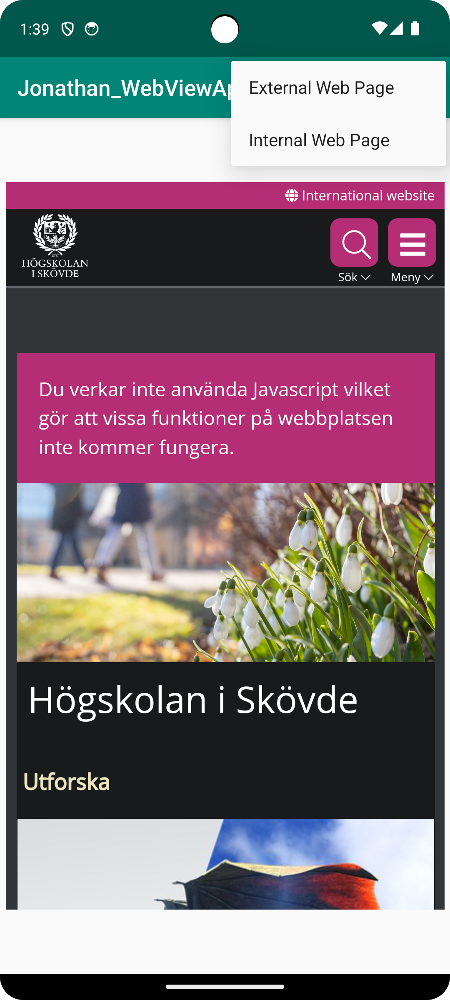
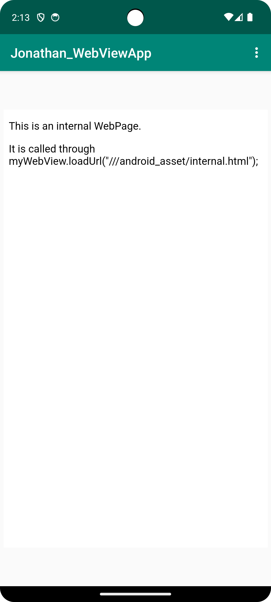

# Rapport

- Ändrade namn på appen till 'Jonathan_WebViewApp'
```
<string name="app_name">Jonathan_WebViewApp</string>
```
- Aktiverade internetåtkomst
```
<uses-permission android:name="android.permission.INTERNET" />
```
- Skapade ett webview-element där en extern och intern webbsida sedan visades
```
<WebView
        android:id="@+id/minwebviewsID"
        android:layout_width="401dp"
        android:layout_height="665dp"
        android:layout_marginStart="5dp"
        android:layout_marginLeft="5dp"
        android:layout_marginTop="5dp"
        android:layout_marginEnd="5dp"
        android:layout_marginRight="5dp"
        android:layout_marginBottom="5dp"
        app:layout_constraintBottom_toBottomOf="parent"
        app:layout_constraintEnd_toEndOf="parent"
        app:layout_constraintStart_toStartOf="parent"
        app:layout_constraintTop_toBottomOf="@+id/appBarLayout" />
```
- 


Interna och Externa websidan lades till under deras respektive funktioner.
"showExternalWebPage()" and "showInternalWebPage()".

```
public void showInternalWebPage(){
        // TODO: Add your code for showing internal web page here
        findViewById(R.id.minwebviewsID);
        myWebView = findViewById(R.id.minwebviewsID);
        myWebView.setWebViewClient(new WebViewClient()); // Do not open in Chrome!
        myWebView.loadUrl("///android_asset/internal.html");
}
    
public void showExternalWebPage(){
    // TODO: Add your code for showing external web page here
    findViewById(R.id.minwebviewsID);
    myWebView = findViewById(R.id.minwebviewsID);
    myWebView.setWebViewClient(new WebViewClient()); // Do not open in Chrome!
    myWebView.loadUrl("https://his.se");
}
```



